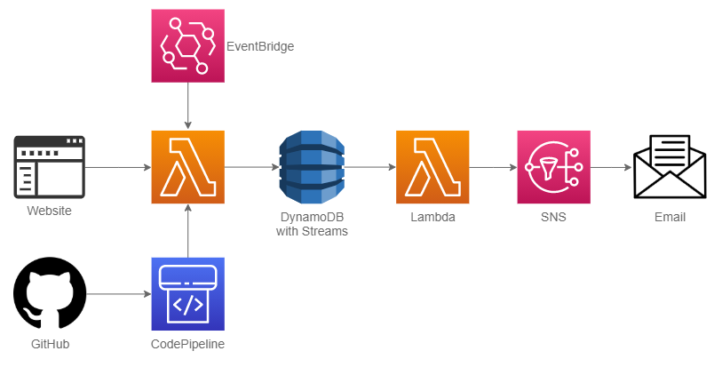

## I finished my first functional project in AWS. 

What a strange time. One day everything is beyond your wildest dreams, you ace your exam, get the best job - the next day the world is in quarantine and everything stops.
 
Over this mad period, I've finished a #serverless Python web scraper, my first personal application. It sends me an email each time a new event is published on a particular website. The website doesn't send any notifications and their events were getting fully booked before I could react. Now I've got an edge over folks booking manually.
 
Very proud of this, given I knew nothing about any of the components merely a few months ago.   

## Technical details.

I've written two Lambda functions in Python with custom IAM roles and settings (timeouts mostly, one environmental variable). First Lambda is deployed from Cloud9, as it was the easiest way to include several 3rd party libraries it required - that's the web scraper itself using libraries such as BeautifulSoup, lxml and requests. Triggered by CloudWatch every 6hrs, the function searches the website against a pattern. Once scraped, the data is then stored in DynamoDB table, which in turn triggers the second Lambda through Streams (DB updates tracker). The output is then sent to my email via SNS topic.   

## Let me know what you think!

I'm very much a beginner, so please share any comments on how to improve this. At the moment probably the weakest part is the first Lambda, the web scraper. The pattern is hard-coded, so any change in formatting on the website will break the app, as it already did once.

Also, looking for suggestions on how to move forward in these weird times!        

*I would like to thank all of the people who helped me here: my Generation tutor Andy Dent and my colleagues [Dan]( https://github.com/dan-how ), Patrick and Natasha.*
